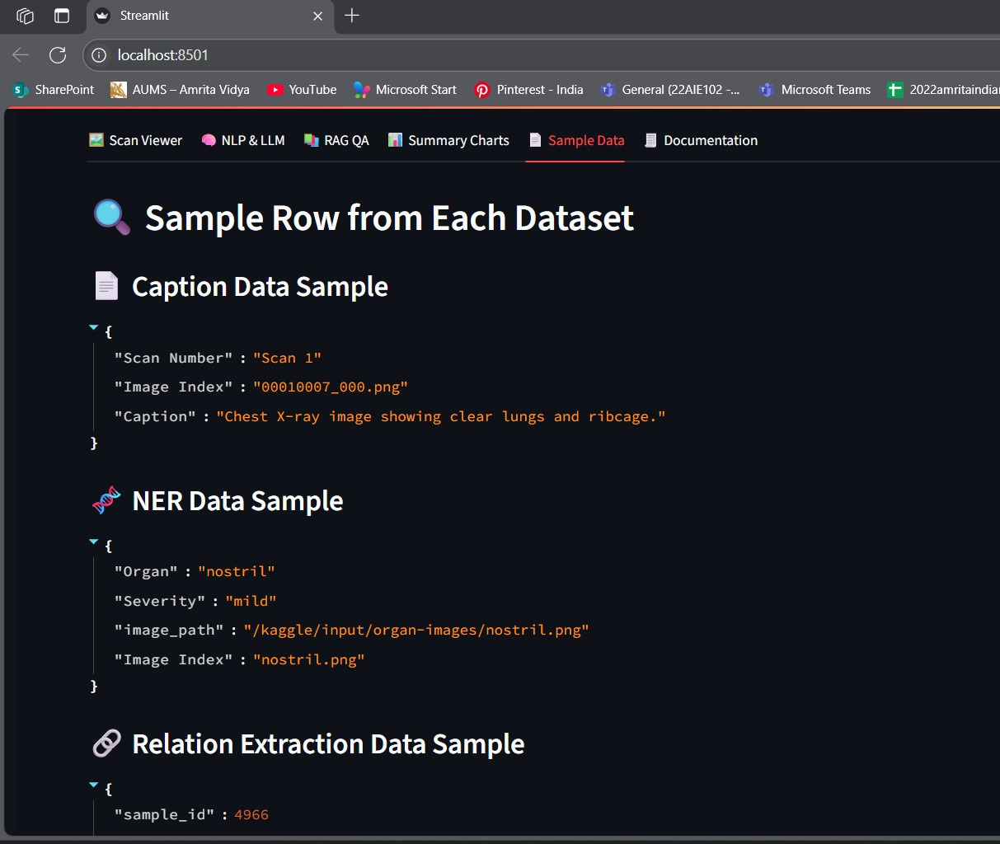
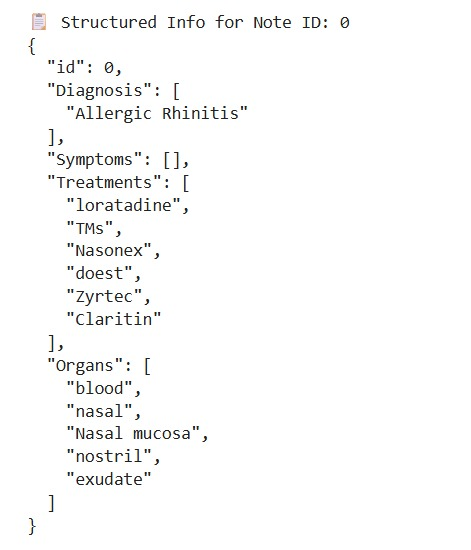
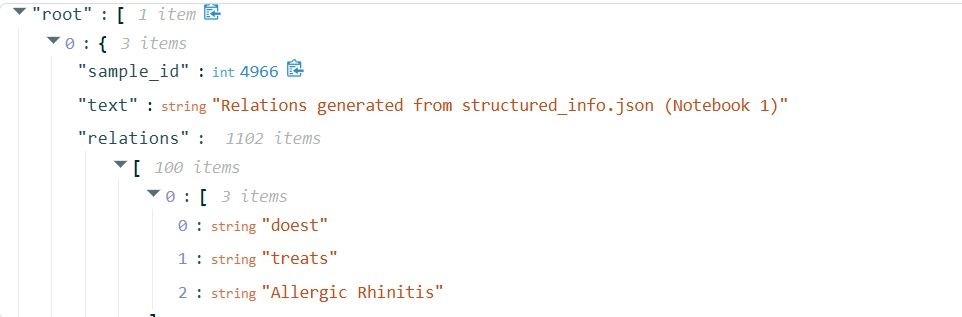
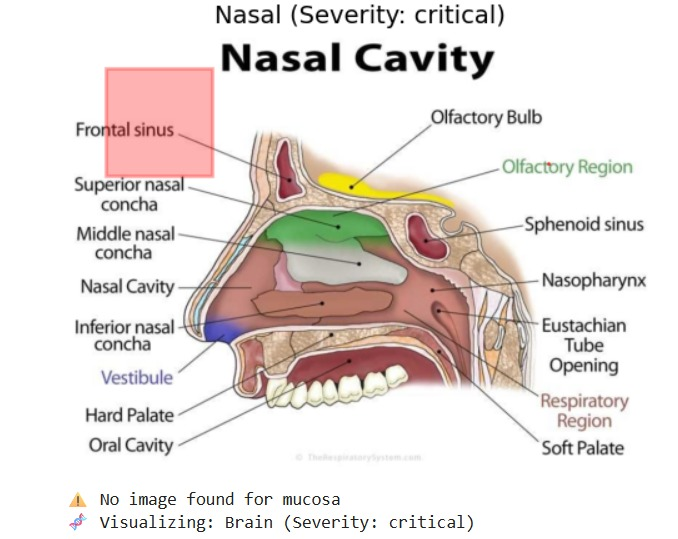

# medical-insight-analyzer
# 🧠 Biomedical NLP and Visualization Pipeline

A modular pipeline for extracting clinical insights from unstructured biomedical text. This project integrates advanced NLP techniques including Biomedical Named Entity Recognition, Relation Extraction, and Anatomical Visualization with LLM-powered summarization and question-answering—all within an interactive Streamlit UI.

---

## 📌 Features

- 🔬 **Biomedical Named Entity Recognition (NER)** using [SciSpacy](https://allenai.github.io/scispacy/)
- 🧩 **Relation Extraction** to identify connections between biomedical entities
- 🧠 **Anatomical Visualization** mapping entities to human body systems
- 🤖 **LLM Integration** for summarization and context-based Q&A
- 🖥️ **Streamlit UI** for running all modules seamlessly in a single app

---

## 🗂️ Project Structure
├── app.py # Main Streamlit App

├── insight_engine.py # Core NLP processing logic

├── rag_module.py # RAG-based summarization and QA module

├── test_import.py # Module testing script

├── requirements.txt # All dependencies

├── data/ # Folder containing input sample data

├── medical-report-information-extraction-1.ipynb # Biomedical NER notebook

├── medical-relation-extraction-2.ipynb # Relation extraction notebook

├── 2d-organ-visualization-with-highlighting-3.ipynb # Anatomy mapping notebook

├── time-based-disease-progression-4.ipynb # (Optional) Timeline module

└── README.md # Project documentation

Create a virtual environment (recommended)
python -m venv venv
source venv/bin/activate  # Windows: venv\Scripts\activate

3. Install dependencies
pip install -r requirements.txt

Module Overview
insight_engine.py – Named Entity Recognition
Uses SpaCy for extracting clinical entities (e.g., diseases, drugs, body parts).

Example:
from insight_engine import extract_entities
entities = extract_entities("Patient has diabetes and high blood pressure.")
medical-relation-extraction-2.ipynb – Relation Extraction
Uses dependency parsing to detect relations like treats, causes, etc.

2d-organ-visualization-with-highlighting-3.ipynb – Organ Mapping
Maps identified entities to anatomical locations.

Visualizes organs and highlights associated conditions.

rag_module.py – Summarization and QA
Retrieves relevant chunks from context and answers user queries using an LLM.

Example:

from rag_module import answer_question
answer = answer_question("What condition does the patient have?", "Patient has chronic kidney disease.")
app.py – Streamlit App
Unified UI for uploading files, running NER, extracting relations, visualizing anatomy, and querying the LLM.

To run:
streamlit run app.py

## 📸 Screenshots

### 🏠 Streamlit UI Homepage

### 🔬 Named Entity Recognition

### 🔗 Relation Extraction

### 🧠 Anatomical Visualization

### Time Progression of the Patient 

### Block Diagram

📚 Dependencies
Python 3.8+

SpaCy

SciSpacy

Streamlit

Matplotlib / Plotly

OpenAI API / HuggingFace Transformers (for LLM)

